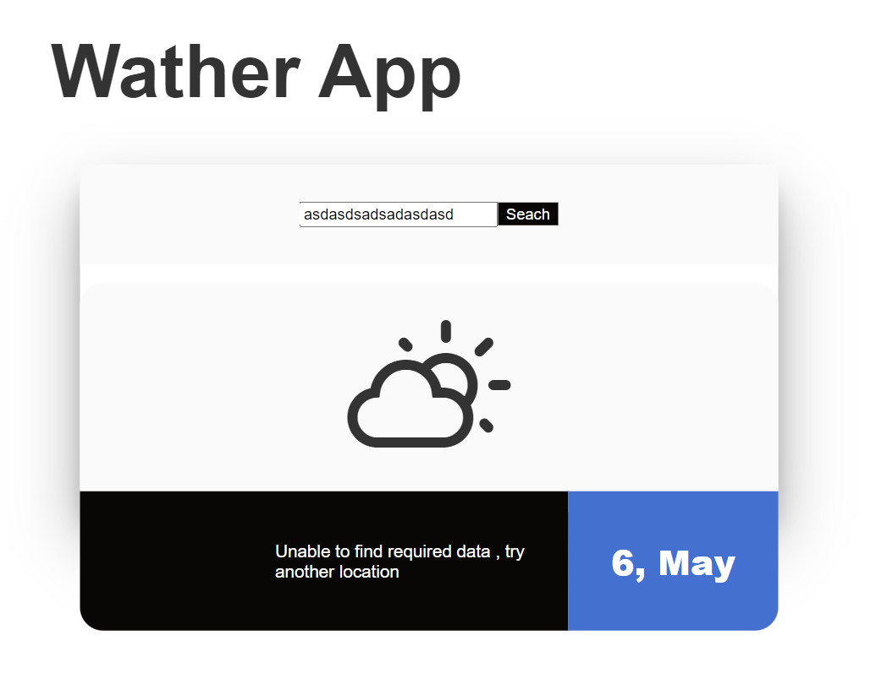

# To start the project write npm i in the terminal

# dependencies on we download the following NPM:

- "express": "4.17.2" - version
  Express.js is an open source library based on MVC, created for Node.js. Express is created under the MIT license, and is maintained by the community.
  Express is considered part of the MEAN software collection, as part of the server side,And with it you can create a server and send requests

- "mongoose": "6.1.7" - version
  Mongoose is a MongoDB object modeling tool designed to work in an asynchronous environment. Mongoose supports both promises and repeat engagements.

- "HBS": "4.2.0" = version
  Handlebars is a simple templating language.
  It uses a template and an input object to generate HTML or other text formats. Handlebars templates look like regular text with embedded Handlebars expressions.

- "request": "2.88.2" = version
  Request - Simplified HTTP client

# In devDependencies install

nodemon - To start the server

# ScreenShot

- If there is no such city you will get an error
  

- Identify a city by name
  
